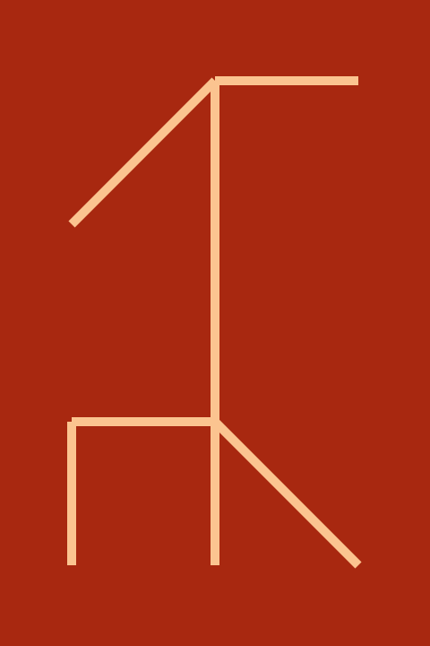

# Cistercian Numbers Drawer

Simple command line application to draw Cistercian Number in SVG format.

To get information about the Cistercian Numbers go to: 
[Cistercian Numerals](https://en.wikipedia.org/wiki/Cistercian_numerals)

# Run
To run this script, you have to pass a number between 0 and 9999 

```commandline
python3 cisternian_cli.py <number>
```
or
```commandline
./cisternian_cli.py <number>
```

More options are available, see them with the command

```commandline
./cisternian_cli.py --help
```

## Example
```commandline
python3 cisternian_cli.py 5362
```
Generate the next image


------

```commandline
python3 cisternian_cli.py --background "#A82810" --color "#FBC490" --stroke 10 -f ./../docs/test_2.svg 8431
```

Generate the next image



## Options

| **Short** | **Long**     | **Description**                                     |
|-----------|--------------|-----------------------------------------------------|
| -h        | --help       | Display the available options                       |
| -v        | --verbose    | Displays more information                           |
| -f        | --filename   | Filename of the SVG image. Default: * out.svg*      |
|           | --width      | Width of SVG image in pixels. Default: *480*        |
|           | --height     | Height of SVG image in pixels. Default: *720*       |
|           | --background | Background color in hexadecimal. Default: *#FFFFFF* |
|           | --color      | Stroke color in hexadecimal. Default: *#000000*     |
|           | --stroke     | Stroke width in pixels. Default: *5*                |
